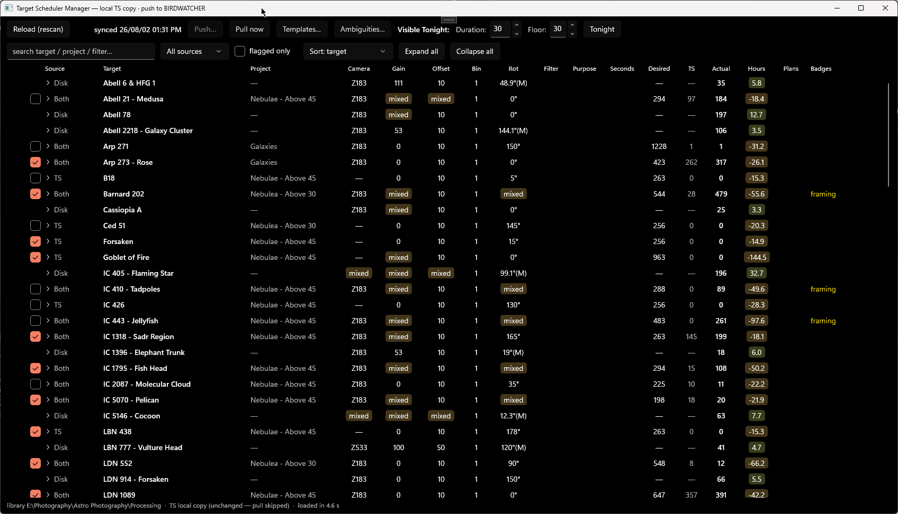

# TargetSchedulerManager

A Windows desktop manager for the database of [Target Scheduler](https://tcpalmer.github.io/nina-scheduler/),
Tom Palmer's scheduling plugin for [N.I.N.A.](https://nighttime-imaging.eu/) — see every scheduler plan
next to what's actually on disk, edit safely on a local copy, and push reviewed changes back to the
imaging rig.

## What it does

- **Plan vs. actual, one grid.** TSM scans the image library (read-only) and reconciles it against
  the Target Scheduler database: every target/filter/exposure cell shows the plan's desired counts
  beside the frames actually captured, with progress shown as time still owed or total captured.
- **Mismatches are the diagnostic.** A plan and its disk frames merge into one row only when they
  agree on everything that decides whether frames integrate together — filter, exposure, gain,
  offset, binning, framing (rotation + pointing). When they don't agree, the grid shows both rows,
  and that separation is the finding.
- **Safe editing via pull → journal → push.** The app never edits the rig's live database directly.
  It pulls a local working copy at open (skipped when provably unchanged), journals every edit, and
  pushes them back only through a reviewed confirmation that replays exactly the edited fields.
- **Visible tonight.** One click enables exactly the targets that clear a configurable altitude
  floor for a configurable duration tonight, and disables the rest — batch-applied, journaled, and
  pushable like any other edit.
- **Mosaics, templates, ambiguity reports** — panels are first-class targets, project/target
  templates speed authoring, and anything the reconciler couldn't place cleanly is reported, never
  silently dropped.

## Install

Download `TargetSchedulerManager-win-Setup.exe` from the
[latest release](https://github.com/Apoplectic1/TargetSchedulerManager/releases/latest) and run
it. The app installs per-user, adds Start Menu shortcuts, and checks for updates at startup.
The installer is not code-signed, so Windows SmartScreen will warn on first run — expected for a
personal tool.

## Status

A personal tool, developed and used nightly by its author; published here as its public face.
The source is offered for reading and reference — **a fresh clone does not build**, because TSM
references a sibling shared astronomy library that is not yet published (its compiled assemblies
ship inside the installer).

## Repo layout

The root reference docs (`ARCHITECTURE.md`, `SUBSYSTEMS.md`, `CONVENTIONS.md`, `DOMAIN.md`,
`TS-SCHEMA.md`, `VERIFICATION.md`, `ROADMAP.md`, `CHANGELOG.md`) are the project's living
documentation. `docs/` is the dated engineering journal, `openspec/` holds the formal behavior
specs and archived change records, and `.claude/` is agent tooling — workshop directories, not
user-facing material.

## License

[MIT](LICENSE)
